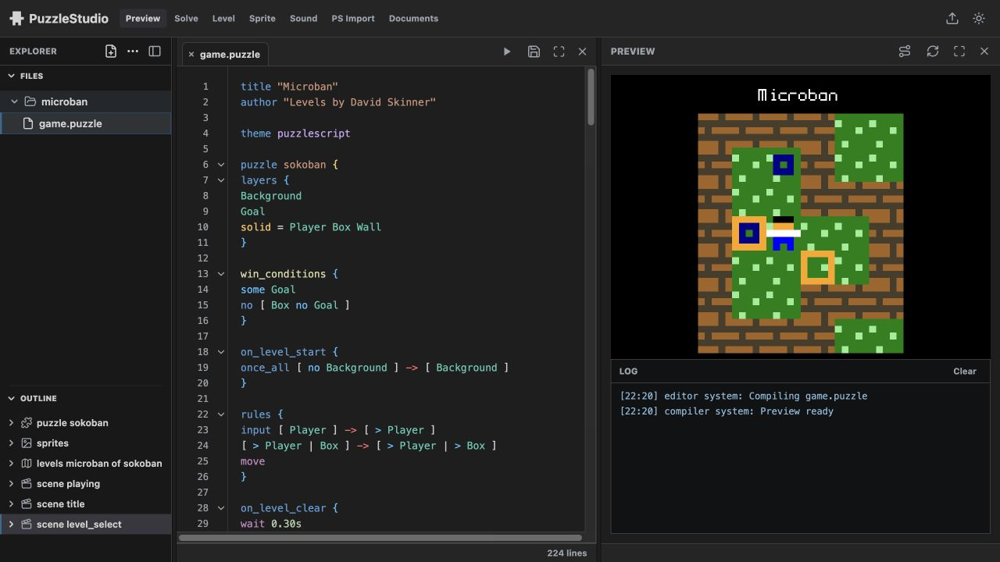

# PuzzleStudio

PuzzleStudio is a small editor for making turn-based, grid-based puzzle games.
It is built for short edit-and-preview loops: write the rules, run the game,
inspect what happened, and adjust the puzzle.



The screenshot shows the Microban sample open in the editor, with the project
folder on the left, source in the middle, and a live level preview on the right.

## Use In The Browser

Open the web editor on GitHub Pages:

[smyrnensis.github.io/PuzzleStudio](https://smyrnensis.github.io/PuzzleStudio/)

The browser version runs as a static GitHub Pages app. It is the easiest way to
try PuzzleStudio without installing anything.

Use it when you want to:

- edit `.puzzle` and `.puzzle3` files
- preview levels in the browser
- try the 2D puzzle flow and the prototype 3D authoring flow
- import or export project files from the editor UI

## Install The Desktop App

The desktop app is a Tauri shell around the same editor. It can open a local
project folder and save files directly through the operating system.

Install Rust first:

[rustup.rs](https://rustup.rs/)

Install the Tauri command for Rust:

```bash
cargo install tauri-cli --version "^2"
```

Clone the repository, then run the desktop app from the repository root:

```bash
cargo tauri dev
```

Build a local macOS app bundle:

```bash
cargo tauri build --bundles app
```

Tauri prints the generated app path when the build finishes. Signing,
notarization, and installer packaging are not part of this repository yet.

## What You Can Make

PuzzleStudio is aimed at deterministic puzzle games where the interesting part
is the state change: movement, pushing, collision, triggers, goals, levels, and
small rule variations.

It is not a general-purpose game engine. The focus is on readable puzzle rules,
fast preview, undo/restart-friendly play, and authoring workflows that are easy
to inspect.

## More Documentation

- `AUTHORING_SYNTAX.md`: `.puzzle` authoring reference
- `DESIGN_PRINCIPLES.md`: project philosophy
- `AGENT_HANDOFF.md`: implementation map for contributors
