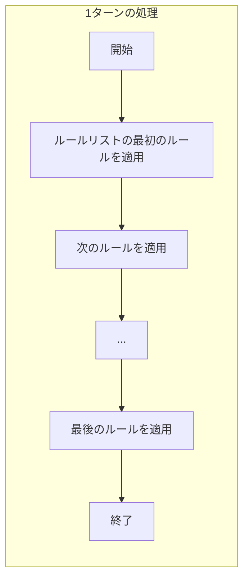

## 1. 概要

`RuleProcessor`は、ルールベース・グリッドパズルゲームフレームワークの中核をなす、データ駆動型のコンポーネントです。

その主な役割は、現在のゲーム状態 (`GameState`) とルール定義リスト (`RuleData`) を受け取り、ルールを適用してゲーム状態を1ターン進め、新しい`GameState`を生成することです。ロジックはすべて外部の`RuleData`によって定義されます。

---

## 2. 責務 (Responsibilities) 🎯

- **ルールの逐次処理**: `RuleData`に含まれるルールを、定義された順序で一度ずつ処理する。
- **パターンマッチング**: 現在の`puzzleState`から、各ルールの`before`パターンに一致する箇所を検索する。
- **条件判定**: パターンがマッチした場合、ルールの`conditions`で指定された`globalState`の条件を検証する。
- **状態更新**: マッチと条件判定が成功した場合、`after`パターンで`puzzleState`を、`effects`で`globalState`を更新する。
- **適用方法のハンドリング**: ルールの`application`プロパティ (`"once"` または `"until_stable"`) に従って、ルールの適用を制御する。
- **方向の展開**: ルールの`direction`プロパティ (`"any"`, `"vertical"`など) に基づき、パターンを回転・反転させてマッチングを行う。
- **複数パターンブロックの処理**: 複数`before`/`after`ブロックを同時に処理する。

---

## 3. 依存関係 (Dependencies) 🤝

`RuleProcessor`が機能するためには、以下のコンポーネントとデータが必要です。

|コンポーネント/データ|目的|
|:--|:--|
|**`GameState`**|現在の盤面 (`puzzleState`) とグローバル変数 (`globalState`) を読み書きするためのデータソース。|
|**`RuleData`**|適用すべきルールのリスト。JSON形式で定義されている。|
|**`ObjectDB`**|オブジェクトのプロパティやタグなどの定義情報を取得するためのヘルパーモジュール。|

---

## 4. 処理フロー ➡️

`RuleProcessor`の処理は、与えられたルールリストを**先頭から末尾まで一度だけ処理する**リニアなフローです。一度評価を終えたルールが、同じターン内で再度評価されることはありません。



### 4.1. ターン全体の流れ (`process_turn`)

1. `RuleData`に含まれるルールのリストを、定義された順序で取得します。
2. リストの先頭から末尾に向かって、各ルールを**一度ずつ**評価・適用します。
3. `application`プロパティに応じて、各ルールの内部的な適用回数が決まります。
4. リストの最後のルールの処理が完了した時点で、1ターン分の処理は**完全に終了**します。

### 4.2. 個別ルールの適用 (`_apply_rule`)

単一のルールを処理する際の挙動は、`application`プロパティによって異なります。

- **`application: "until_stable"`**
    - ルールが盤面上のどこにも適用できなくなる（安定する）まで、**そのルール自身の適用を繰り返します**。
    - 安定したら、次のルールへ処理が移ります。
- **`application: "once"`**
    - 盤面上でルールにマッチする箇所を**最大で1回**だけ適用します。
    - 適用されたら、それ以上のマッチングは行わず、すぐに次のルールへ処理が移ります。

---

## 5. 中核ロジック詳細 ⚙️

### 5.1. パターンマッチング

ルールの`before`ブロックの各要素 (`objects`, `has_objects`, `no_objects`) を、盤面の対応するセルと比較します。

- **オブジェクトの解決**: セル内のオブジェクト文字列 (`"Player:right"`) とルール内の指定 (`"@Movable"`, `"Box"`) を比較する際、`ObjectDB`を利用します。
    - `@`で始まるプロパティ指定や、`!`による否定条件を解決します。
    - `:`で区切られたタグを解析します。
- **方向の解決**: ルールの`direction` (`any`, `horizontal`など) に基づき、パターン内の相対座標と相対方向タグ (`>`,`<`など) を、チェック対象の絶対方向に合わせて変換します。

### 5.2. 状態の更新

- **`after`ブロック**:
    - `before`ブロックの`objects`キーで指定されたセルのみが置換対象です。
    - `after`ブロックの定義に従い、対象セルのオブジェクトリストを更新します。
- **`effects`ブロック**:
    - `set`: `globalState`の変数を指定した値に設定します。
    - `change`: `globalState`の変数を指定した値だけ増減させます。
    - `sound` / `message`: 対応するイベントを発行するよう外部に通知します。

### 5.3. オブジェクト単位の置換（PuzzleScript互換）

ルールの置換 (`after`) 処理は、セル全体を上書きするのではなく、**マッチしたオブジェクトのみを置換**する、より精密な方法で行われます。

#### 更新アルゴリズム

1. **マッチング**: `before` 条件に基づき、セル内のどのオブジェクトがマッチしたかを特定します。
    
    - 例: セル `["A", "C"]` に対し、`before: ["A"]` はオブジェクト "A" をマッチ対象として特定します。
2. **更新処理**:
    
    - まず、セルの現在のオブジェクトリストから、ステップ1で特定した**マッチ対象オブジェクトのみを削除**します。
        - 例: `["A", "C"]` から "A" を削除し、一時的に `["C"]` となります。
    - 次に、そのリストに `after` ブロックで定義された新しいオブジェクトを**追加**します。
        - 例: `["C"]` に "B" を追加し、最終的に `["B", "C"]` （または `["C", "B"]`、順序は描画等に影響しない）となります。

#### その他の例

- **オブジェクトの破壊**:
    
    - ルール: `[A] -> []`
    - 適用対象セル: `["A", "C"]`
    - 結果: `["C"]` ("A"だけが消え、"C"は残る)
- **複数オブジェクトのマッチング**:
    
    - ルール: `[A, B] -> [D]`
    - 適用対象セル: `["A", "B", "C"]`
    - 結果: `["D", "C"]` ("A"と"B"が消え、"D"が追加され、"C"は残る)

### 5.4. 複数パターンブロックの処理

#### 処理方式

1. **ブロック対応**: `before`配列の各要素は、`after`配列の同じインデックスの要素と対応します。
2. **独立したマッチング**: 各`before`ブロックは独立してマッチングされ、それぞれ異なる位置を参照できます。
3. **同時適用**: すべての`before`ブロックがマッチした場合のみ、対応するすべての`after`ブロックが適用されます。

#### 例

```json
{
  "before": [
    {
      "direction": "any",
      "pattern": [
        { "position": {"x": 0, "y": 0}, "objects": ["Player:>"] },
        { "position": {"x": 1, "y": 0}, "objects": ["Button"] }
      ]
    },
    {
      "direction": "none",
      "pattern": [
        { "position": {"x": 0, "y": 0}, "objects": ["Gate:close"] }
      ]
    }
  ],
  "after": [
    {
      "pattern": [
        { "position": {"x": 0, "y": 0}, "objects": [] },
        { "position": {"x": 1, "y": 0}, "objects": ["Player", "Button"] }
      ]
    },
    {
      "pattern": [
        { "position": {"x": 0, "y": 0}, "objects": ["Gate:open"] }
      ]
    }
  ]
}
```

この例では、プレイヤーがボタンを押すと同時に、どこか別の場所のゲートが開きます。

## 6. API（インタフェース案）

`GameManager`などの上位コンポーネントから呼び出されることを想定した、シンプルなインタフェースです。

```gdscript
# RuleProcessor.gd

# 依存関係
var object_db: ObjectDB

func _init(db: ObjectDB):
	self.object_db = db

# メインの実行関数
# GameStateとRuleDataを受け取り、変更後のGameStateを返す
func process_turn(current_gamestate: Dictionary, rules: Array) -> Dictionary:
	var new_gamestate = current_gamestate.duplicate(true)
	
	# ルールリストを最初から最後まで一度だけ処理する
	for rule_data in rules:
		_apply_rule(new_gamestate, rule_data)
			
	return new_gamestate


# 個別ルールを適用する内部関数
func _apply_rule(gamestate: Dictionary, rule: Dictionary):
	# この関数内で "once" と "until_stable" のロジックをハンドリングする
	# 複数のbeforeブロックがある場合、すべてがマッチする必要がある
	pass
```

## 7. 具体的なルール記述例

### 7.1 プレイヤーが箱を押す

```json
{
  "name": "push_box",
  "application": "once",
  "before": [
    {
      "direction": "any",
      "pattern": [
        { "position": {"x": 0, "y": 0}, "objects": ["Player"] },
        { "position": {"x": 1, "y": 0}, "objects": ["Box"] },
        { "position": {"x": 2, "y": 0}, "no_objects": ["Wall"] }
      ]
    }
  ],
  "after": [
    {
      "pattern": [
        { "position": {"x": 0, "y": 0}, "objects": [] },
        { "position": {"x": 1, "y": 0}, "objects": ["Player"] },
        { "position": {"x": 2, "y": 0}, "objects": ["Box"] }
      ]
    }
  ],
  "effects": {
    "sound": "push"
  }
}
```

**注**: `before`と`after`は配列形式で、この例では1つのブロックのみを含んでいます。

### 7.2 重力

```json
{
  "name": "gravity",
  "application": "until_stable",
  "before": [
    {
      "direction": "down",
      "pattern": [
        { "position": {"x": 0, "y": 0}, "objects": ["@falling"] },
        { "position": {"x": 0, "y": 1}, "no_objects": ["@solid"] }
      ]
    }
  ],
  "after": [
    {
      "pattern": [
        { "position": {"x": 0, "y": 0}, "objects": [] },
        { "position": {"x": 0, "y": 1}, "objects": ["@falling"] }
      ]
    }
  ]
}
```

### 7.3 複数ブロックの例：ボタンとゲート

```json
{
  "name": "button_opens_gate",
  "application": "once",
  "before": [
    {
      "direction": "any",
      "pattern": [
        { "position": {"x": 0, "y": 0}, "objects": ["Player:>"] },
        { "position": {"x": 1, "y": 0}, "objects": ["Button"] }
      ]
    },
    {
      "direction": "none",
      "pattern": [
        { "position": {"x": 0, "y": 0}, "objects": ["Gate:close"] }
      ]
    }
  ],
  "after": [
    {
      "pattern": [
        { "position": {"x": 0, "y": 0}, "objects": [] },
        { "position": {"x": 1, "y": 0}, "objects": ["Player", "Button:pressed"] }
      ]
    },
    {
      "pattern": [
        { "position": {"x": 0, "y": 0}, "objects": ["Gate:open"] }
      ]
    }
  ],
  "effects": {
    "sound": "gate_open",
    "message": "The gate opens!"
  }
}
```

この例では、プレイヤーがボタンを押すと、盤面上のどこかにあるゲートが開きます。2つの`before`ブロックが独立してマッチングされ、両方が成功した場合に2つの`after`ブロックが同時に適用されます。